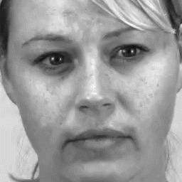
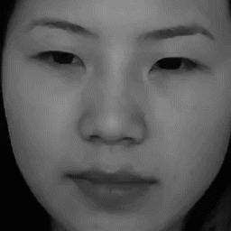
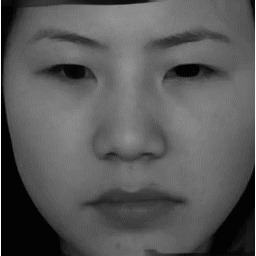
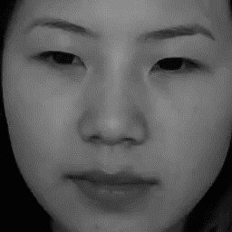
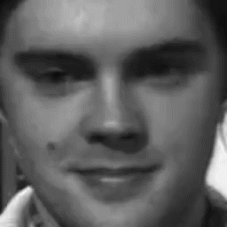
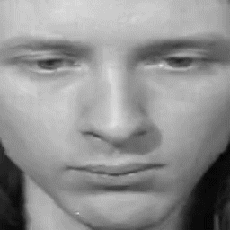
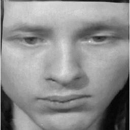
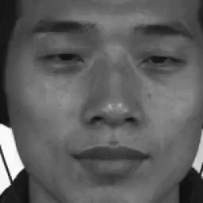
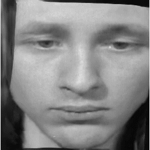
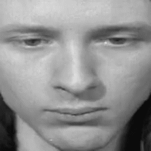

# Facial-Prior-Based-FOMM
Facial Prior Based First Order Motion Model for Micro-expression Generation

> **FME Challenge 2021 and ACM Multimedia 2021**  
>
> Official Site: https://megc2021.github.io/index.html

## 0. Table of Contents

* [0. Table of Contents](#0-table-of-contents)

* [1. Authors & Maintainers](#1-authors---maintainers)

* [2. Change Log](#2-change-log)

* [3. Results in GIF](#3-results-in-gif)

* [4. Run the Code](#4-run-the-code)

* [5. License](#5-license)

  

## 1. Authors & Maintainers

- [Yi Zhang|@zylye123](https://github.com/zylye123)
- [Youjun Zhao|@zhaoyjoy](https://github.com/zhaoyjoy)
- [Yuhang Wen|@Necolizer](https://github.com/Necolizer)
- [Zixuan Tang|@sysu19351118](https://github.com/sysu19351118)
- [Xinhua Xu|@sysu19351158](https://github.com/sysu19351158)

## 2. Change Log

- [2021/07/12] Qualitative results are presented in GIF format.
- [2021/07/10] Create repository, add basic information, and upload code.

## 3. Results in GIF

> **NOTICE**: For visual presentation, all the GIFs have been **slowed down**.

| No.  |                            Source                            |                             FOMM                             |                             MRAA                             |                            OurSA                             |                            OurSM                             |                            OurCA                             |                            OurMX                             |
| :--: | :----------------------------------------------------------: | :----------------------------------------------------------: | :----------------------------------------------------------: | :----------------------------------------------------------: | :----------------------------------------------------------: | :----------------------------------------------------------: | :----------------------------------------------------------: |
|  1   |        |   |   |  |  |  |    |
|  2   |       |  |  |  |  |  |   |
|  3   |  |  |  |  |  |  |  |

`Source` == Source videos, also called driving videos

`OurSA` == Our method, training on SAMM

`OurSM` == Our method, training on SMIC-HS

`OurCA` == Our method, training on CASMEⅡ

`OurMIX` == Our method, training on SAMM + SMIC-HS + CASMEⅡ

## 4. Run the Code

1. Prepare your dataset. Recommend CASME2, SAMM, SMIC-HS

   Divide into `your_dataset/train` and `your_dataset/test`

   Create or modify `yaml` format file `your_dataset_train.yaml` in `./config`

2. Run `kpmaker.py`

   ```shell
   python kpmaker.py
   ```

   Key points of each video in your dataset would be generated in`./keypoint_folder`

3. Train

   ```shell
   python run.py --config config/your_dataset_train.yaml
   ```

   Log and parameters would be saved in `./log`

4. Test

   ```shell
   python run.py --config config/my_dataset_test.yaml --mode animate --checkpoint path/to/checkpoint
   ```

   Generated videos would be saved in `path/to/checkpoint/animation`

## 5. License

[MIT](https://github.com/Necolizer/Facial-Prior-Based-FOMM/blob/main/LICENSE)
